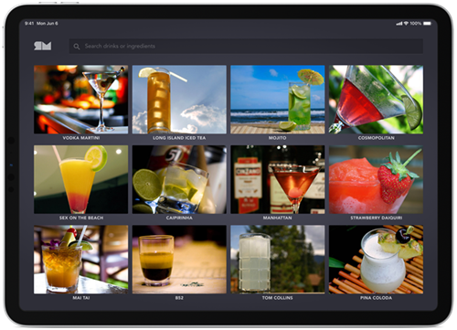

# Food_drink_menu Instruction

Day 43  –  Food/Drink Menu

Challenge: Design an interactive menu for an online store or restaurant.”

# Design

I want to do these in order:

1. The Food/Drink Menu picture page it self.

2. Cart page.

3. Order page.

4. Sign in page.

The instructor said he wanted all the code in the main.dart.

## The Food/Drink Menu picture page it self

d

1. Goods

2. Logo.

3. Search bar.

d

1
